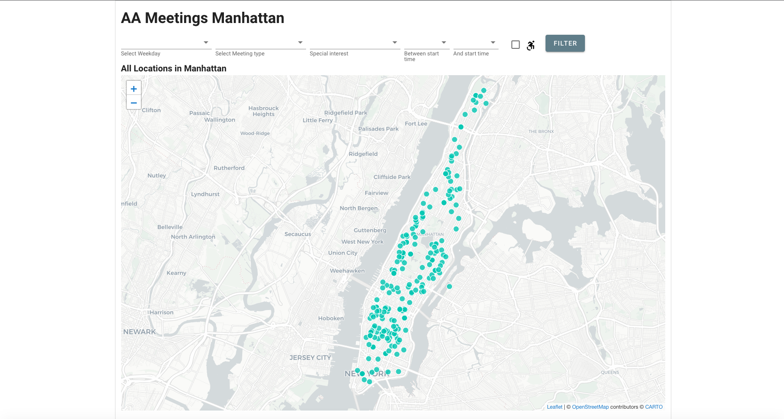
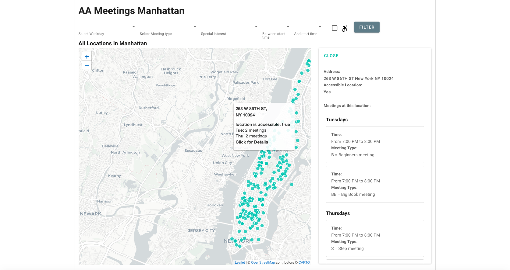
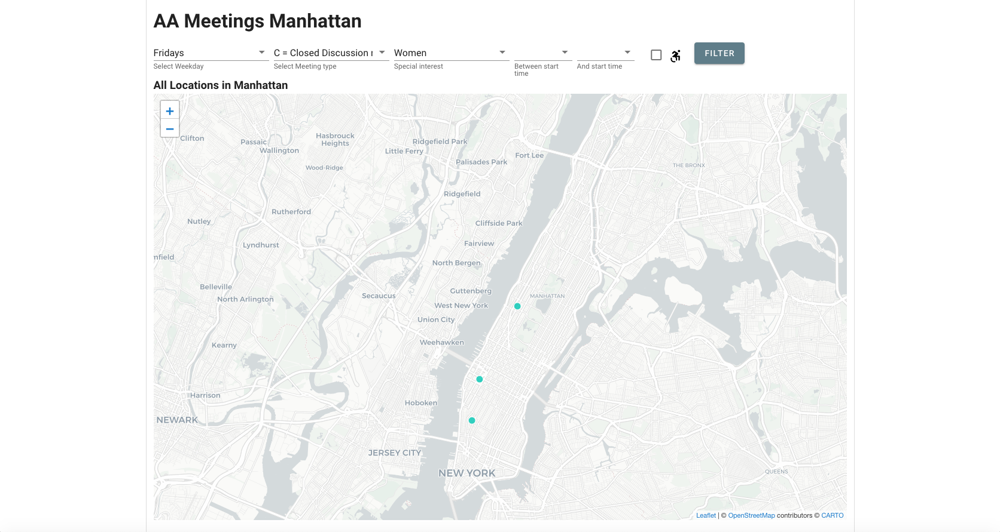
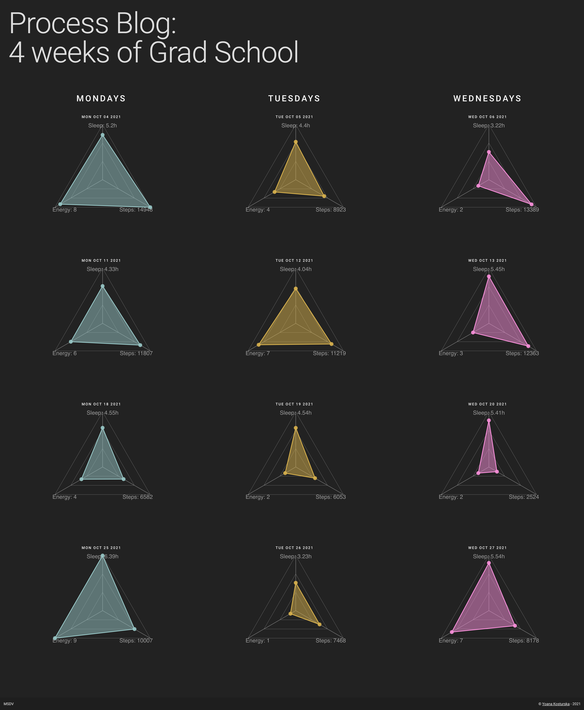

### Final Projects

#### AA Meetings

For the project I used two endpoints to connect the frontend to the PostgreSQL database: the first one takes the data for all locations, and the second one takes data based on user filtering criteria. Initially all locations are plotted on the map with data about the amount of meetings per weekday in each location. 

On click, a side-view shows with the listed meetings.

Users can filter the meetings based on the criteria in the menu above the map. This makes a call to the database and returns a filtered selection of locations, which are then plotted on the map. Users can again click on location to expand all metadata for the meetings at it.

#### Process Blog - 4 Weeks of Grad School

The process blog *4 Weeks of Grad School* connects to the DynamoDB database through one endpoint, which scans for all available data. It is then used on the frontend to visualize the metrics I collected for four weeks - amount of sleeps (in hours), amount of steps taken during the day, and energy level (on a scale 1 to 10). 

Users can compare the radar charts horizontally and vertically. The horizontal part of the grid represents each week, and the vertical one represents the days for which I collect data - Mondays, Tuesdays and Wednesdays.

