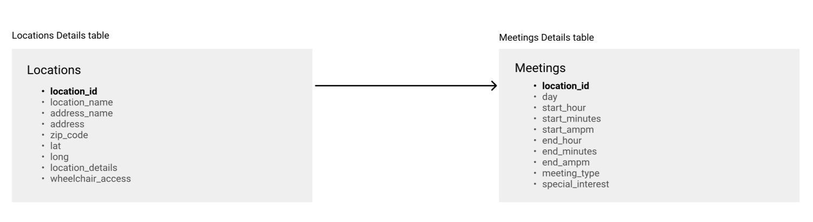
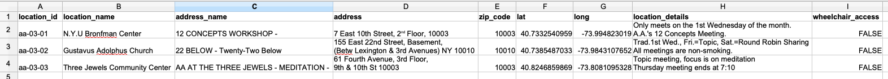
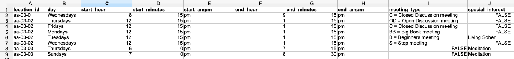

#### Data Structures - Wekly Assignment 4.1

Assignment requirements:

Using the Hills text as a starting point (but feel free to strike out on your own), draw a data model for the AA meetings data to be stored in a database. Include all the content/data/variables from the source file that you believe to be relevant, even if you haven't parsed it yet. Upload an image (png format) of your drawing to your GitHub repository.

Using Excel, populate a dummy table(s) with ALL the data from the first three rows of the AA zone you have been working with. If you decide to organize this into multiple tables, create multiple tabs in the spreadsheet and make it clear how the tables would relate to each other. Update your GitHub repository with the relevant files; for this week, this should include the image/PDF of your schema design and also your Excel file. 

##### Solution:
I created a database schema, containing two separate tables: Locations and Meetings. 

Schema:

Locations table:

Meetings table:
