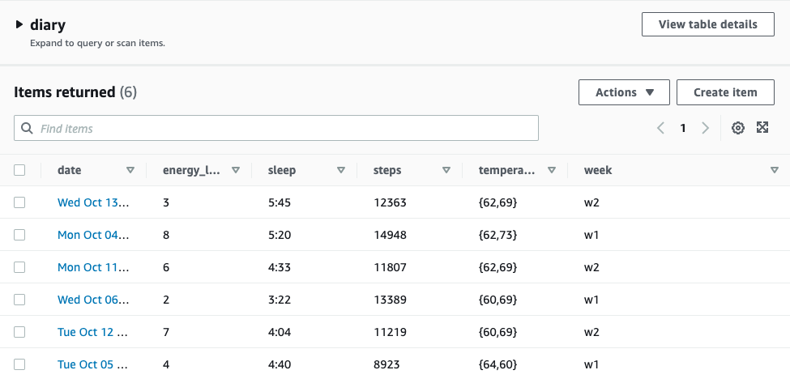

#### Data Structures - Wekly Assignments 04.2 and 05.2

Assignment requirements:

04.2: Create a table in PostgreSQL and host it using Amazon Web Services. Populate the database with the aa-meetings data from the previous assignments.

05.2: Create a table in DynamoDB and host it using Amazon Web Services. Populate the database with the data for the process blog. 

##### Solution:
04.2: The solution contains three separate files with each step of the assignment - create_table.js which creates the PostgreSQL table, insert_data.js which inserts the data from the aa-meetings file to the database, and validate_data.js which performs a simple query to confirm the database was created and the data was inserted properly. All three files are using .env file, which holds the user, host, database, password and port information.

05.2: The solution contains one file, which creates and pushes the first six process blog entries into the DynamoDB table. The table was initially created using AWS interface. 

