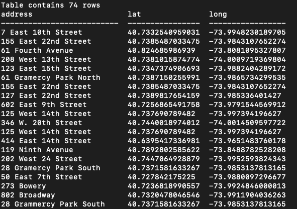
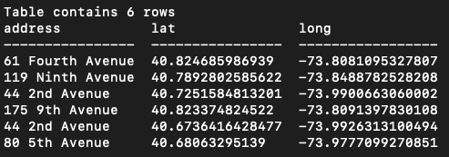
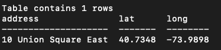
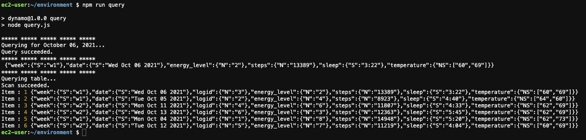

#### Data Structures - Wekly Assignment 06

Assignment requirements:

Part one: Query the PostgreSQL database.

Part two: Query the DynamoDB database.

#### Solution:
##### Part one: PostgreSQL
The query file contains three different query options for the PostgreSQL data: 1 - take all data from the database; 2 - query based on a word the address contains (for example 'Avenue'); 3 - match a specific address. The script uses .env file to securely store all information needed to access the database.

##### Part two: DynamoDB
The file contains two queries for the DynamoDB data: 1 - return all data for a specific date using query; 2 - return all rows from the database using scan. The scan function has an additional if statement, which checks if some data was not returned due to the database's limitations, and performs the scan again if needed.

